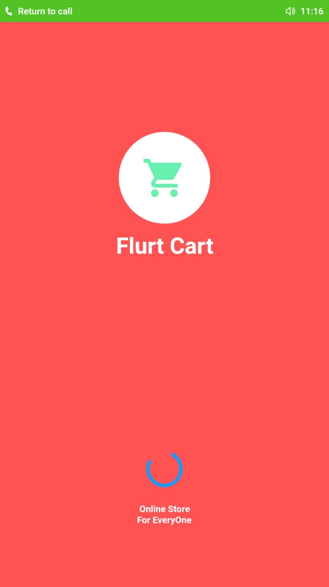

# fluttersplash

A new Flutter project.

## Installation

For this project, you will need to follow flutter.io to setup your enviroment for android. A breif summery:

   1) Download android studio on your machine and go to plugins and download the flutter plugin module for android.
   2) Next Download the flutter SDK and extract it.
   3) Go to extracted flutter directory and run the flutter_console.bat on windows or flutter_console.sh on linux to get flutter console.
   4) Run flutter doctor in the console.
   5) After cloning, run (flutter packages get) and it will download all the dependancies from the pubspec.yaml. Then start your choice of emulator and run your application. This should start the application into your virtual phone emulator.
   
## Screenshot
   
   
## Getting Started

This project is a starting point for a Flutter application.

A few resources to get you started if this is your first Flutter project:

- [Lab: Write your first Flutter app](https://flutter.dev/docs/get-started/codelab)
- [Cookbook: Useful Flutter samples](https://flutter.dev/docs/cookbook)

For help getting started with Flutter, view our 
[online documentation](https://flutter.dev/docs), which offers tutorials, 
samples, guidance on mobile development, and a full API referenc